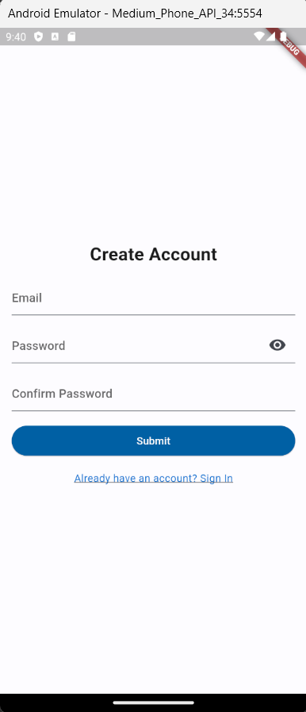

# IndriEye

Orang Tunanetra biasanya memiliki kesulitan dalam beraktivitas dan kurang mengetahui objek di depannya. Atas dasar tersebut kami membuat sebuah aplikasi untuk membantu kemampuan penglihatan dan sebagai penuntun mereka beraktivitas. Kami memanfaatkan kamera smartphone untuk mengganti kemampuan penglihatan, serta voice support untuk memandu aktivitas sehari-hari mereka.

## Anggota Tim
|  Greybox |                                    |
|----------|------------------------------------|
|  Hacker  | Muhammad Luthfi Khusyasy & Raditya Aydin |
|  Hustler | Anak Agung Gde Pradnyana            |
|  Hipster | Ari Ziddan Nugraha                  |

## Hacker 2nd Submission

### Register

### Login

### Deteksi Rintangan

Saat ini menggunakan model `SSDMobileNet`, nantinya akan diganti dengan model yang dibuat sendiri khusus untuk deteksi rintangan pada jalanan.

### Baca Teks

`WIP`

## Development Notes

### Errors
- [A problem occurred evaluating project ':tflite'.](https://github.com/shaqian/flutter_tflite/issues/254)
