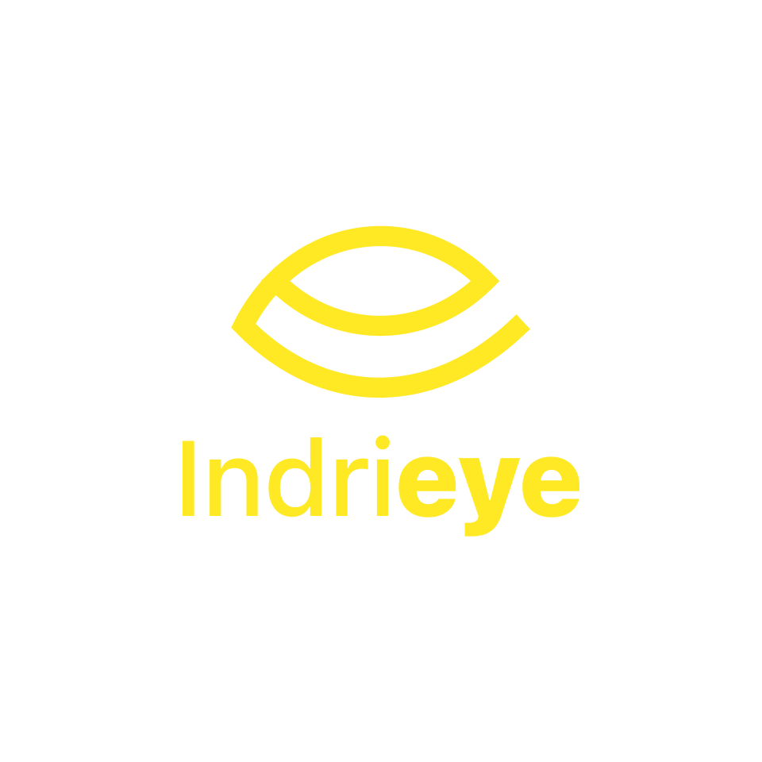
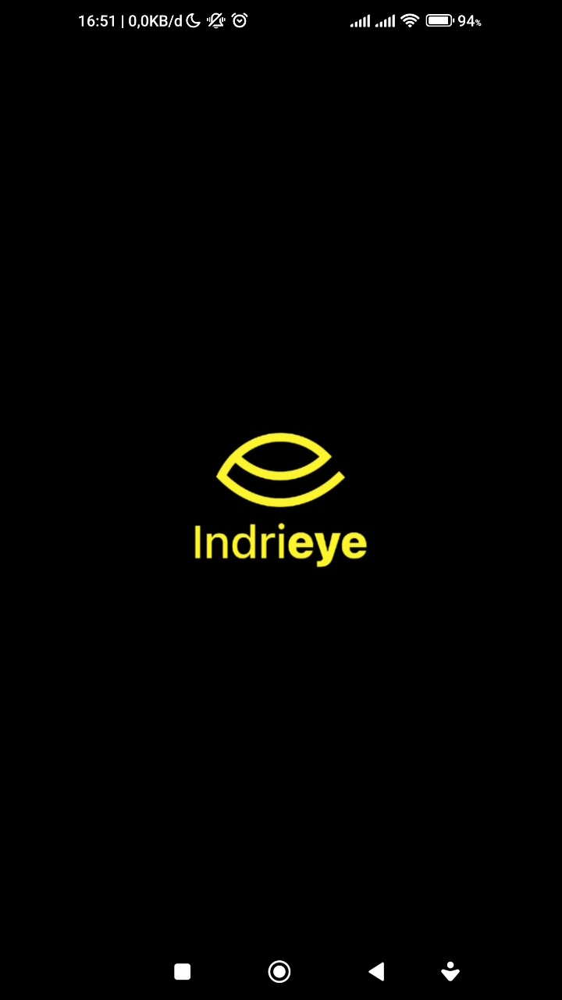
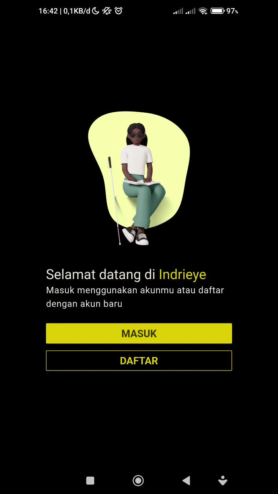
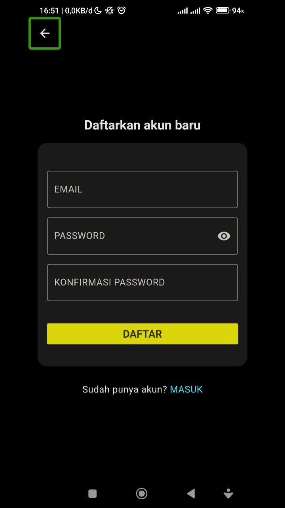
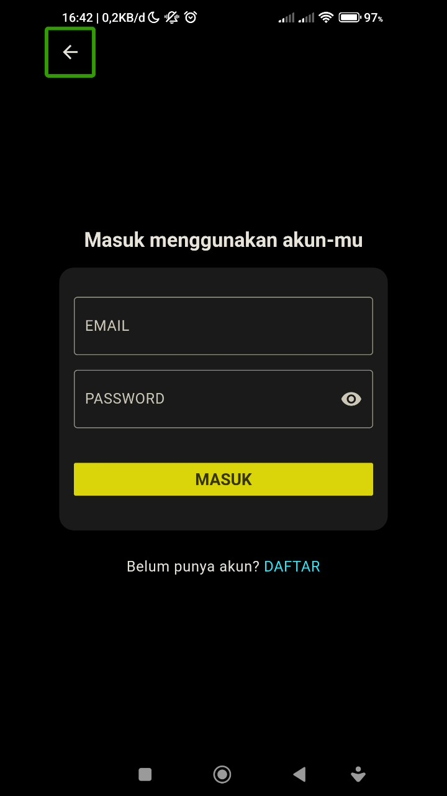

# IndriEye

  

    
    

- TensorFlow Lite to run machine learning models on mobile devices for real-time object detection.
- Google ML Kit to use pre-trained machine learning models from Google for object detection and text recognition.
- We are planning to build our own model for the specific use case of detecting obstacles.

## APK Download

[Download Link](https://bit.ly/Indrieye)

## Screenshots

    
    

### Register

### Login

### Obstacle Detection

### Text Reader

## How to Run Development

